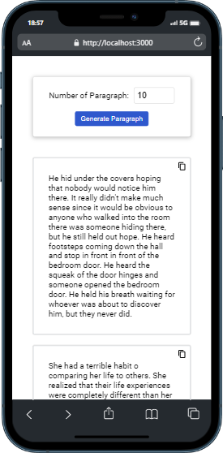
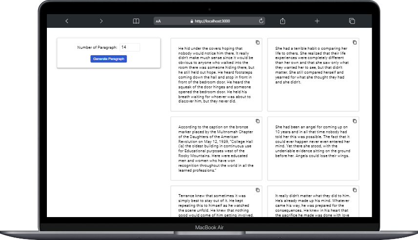

# React randomPragraf :

### Proje özeti :

> Proje React ile yazıldı temel amaç istenilen kadar random paragraf üretmek

### Proje durumu ve yapılacaklar :

- [x] paragraf üretme
- [x] boş değer hatası 
- [x] üretilen paragrafı kopyalama 
- [x] responsive tasarım

### Projede kullanılan Teknolojiler ve Metotlar :

> Projede useState, useEffect hook kullanıldı.
> stilendirme için herhangi bir kütüphane kullanılmadı pure css ile stilendirme yapıldı.
> react icon kullanıldı
> react copy clipboard kullanıldı
> context api kullanıldı.
> deploy için vercel kullanıldı.

### proje font ve renk:

(font-family: 'Roboto', sans-serif;)
(background-color: #FFFFFF;)
(button background-color: #2F58CD;)

### Proje Adresi

[volkiparagraf](https://volkiparagraf.vercel.app/)

### Projenin Görselleri:

